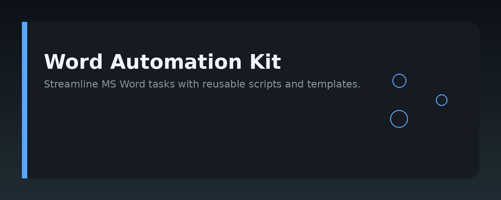
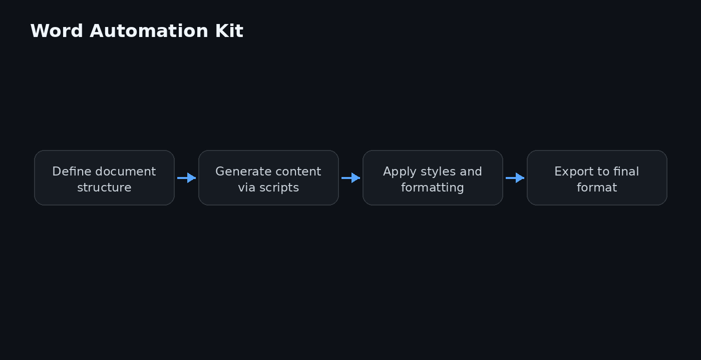

# Word Automation Kit




## Overview

Word Automation Kit is a collection of scripts, templates, and reusable modules for programmatically creating, editing, and managing Microsoft Word documents. It focuses on the common tasks developers hit when working with `.docx` files: generating reports, filling templates, merging documents, and converting content between formats.

The kit is language-agnostic in spirit — it ships with Python examples using `python-docx`, but the patterns and document-structure guidance apply equally to JavaScript, C#, or any other toolchain that manipulates Office Open XML.

## Why it exists

Most Word automation guides are either too shallow (a single "hello world" script) or too deep (full OOXML spec dumps). This repo fills the gap with practical, working patterns that solve real problems:

- **Template filling** without fragile find-and-replace hacks.
- **Report generation** that keeps styling consistent across runs and paragraphs.
- **Document merging** that preserves headers, footers, and section breaks.
- **Bulk conversion** between `.docx`, `.pdf`, and plain text without losing structure.

The code here is written to be copied, adapted, and extended — not to be a framework you depend on.

## Core concepts

Before diving in, understand these building blocks:

- **Paragraphs and runs** — A paragraph is a block of text; a run is a contiguous span with identical formatting. Bold, italic, and font changes always happen at the run level.
- **Sections** — A document is divided into sections, each with its own page size, margins, headers, and footers. `Next Page` section breaks are the usual way to change layout mid-document.
- **Styles** — Named styles (`Normal`, `Heading 1`, `Custom Style`) are the cleanest way to keep formatting consistent. Apply a style instead of manually setting fonts on every run.
- **Placeholders** — For template filling, use a unique token like `{{customer_name}}` inside a paragraph. Replace the text of the run that contains the token, not the whole paragraph, to preserve formatting.
- **Tables** — Tables are made of rows and cells. Cell text is just paragraphs, so the same run/style rules apply inside a cell.

## Architecture

```
word-doc-automation-kit/
├── assets/               # Banner and architecture images
├── examples/
│   ├── python/
│   │   ├── create_report.py
│   │   ├── fill_template.py
│   │   ├── merge_documents.py
│   │   └── convert_to_pdf.py
│   └── templates/
│       ├── invoice_template.docx
│       └── report_template.docx
├── src/
│   ├── doc_utils.py      # Shared helpers (run replacement, style setup)
│   └── merge.py          # Document merge logic
├── tests/                # Unit tests for src modules
└── README.md
```

The `src` directory holds reusable helpers. The `examples` directory shows how to use them in complete scripts. Keep your own business logic separate from the document-manipulation code — it makes both easier to test and maintain.

## Practical workflow

1. **Start from a template** — Create the document in Word with placeholder tokens and named styles. This gives you visual control over layout.
2. **Load the template** in your script.
3. **Replace placeholders** run-by-run, not paragraph-by-paragraph.
4. **Add dynamic content** — tables, charts, or new paragraphs — using the styles already defined in the template.
5. **Save or convert** the result.

This flow works for one-off reports and for batch processing thousands of documents. The same code path handles both.

## Examples

### Python: Fill a template

```python
from docx import Document

def fill_template(template_path, output_path, data):
    doc = Document(template_path)
    for paragraph in doc.paragraphs:
        for run in paragraph.runs:
            for key, value in data.items():
                if key in run.text:
                    run.text = run.text.replace(key, value)
    doc.save(output_path)

data = {
    "{{customer_name}}": "Acme Corp",
    "{{invoice_number}}": "INV-2024-001",
    "{{amount}}": "$1,250.00",
}
fill_template("templates/invoice_template.docx", "output/invoice.docx", data)
```

### Python: Create a report with a table

```python
from docx import Document
from docx.shared import Pt

doc = Document()
doc.add_heading("Monthly Sales Report", level=1)

table = doc.add_table(rows=3, cols=2)
table.style = "Light Grid Accent 1"
headers = ["Region", "Revenue"]
for i, header in enumerate(headers):
    table.rows[0].cells[i].text = header

data = [("North", "$80k"), ("South", "$65k")]
for row_idx, (region, revenue) in enumerate(data, start=1):
    table.rows[row_idx].cells[0].text = region
    table.rows[row_idx].cells[1].text = revenue

doc.save("output/monthly_report.docx")
```

### Python: Merge two documents

```python
from docx import Document

def merge_documents(doc_paths, output_path):
    merged = Document()
    for path in doc_paths:
        doc = Document(path)
        for element in doc.element.body:
            merged.element.body.append(element)
    merged.save(output_path)

merge_documents(["part1.docx", "part2.docx"], "output/merged.docx")
```

Note: the merge example above appends raw elements. For documents with different section settings, you may need to copy section properties explicitly — see `src/merge.py` for the full version.

## FAQ

**Why use run replacement instead of `paragraph.text = ...`?**
Setting `paragraph.text` wipes all run-level formatting. Replacing text inside a run keeps bold, italic, and font size intact.

**How do I handle placeholders that span multiple runs?**
Word often splits a token across runs. Normalize first: merge runs in a paragraph, or search for the token across the concatenated run text and split the replacement accordingly.

**Can I generate a PDF?**
Yes. Use LibreOffice headless (`soffice --convert-to pdf`) or a library like `docx2pdf`. The `.docx` must be saved first.

**Does this work with `.doc` (old format)?**
No. The kit targets `.docx` (Office Open XML). Convert legacy `.doc` files first, or use a dedicated converter.

**How do I add page numbers or a header?**
Access `doc.sections[0].header` and add a paragraph with a `PAGE` field. For page numbers in the footer, use the same approach on `doc.sections[0].footer`.

**Why is my table style not applying?**
The style name must exist in the template's style collection. Built-in styles like `Light Grid Accent 1` are available in default templates, but custom styles need to be defined in the document you load.

## License

MIT — see [LICENSE](LICENSE) for details. Use the code freely in commercial and personal projects.

Topic: `word-document-automation`
